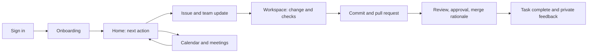
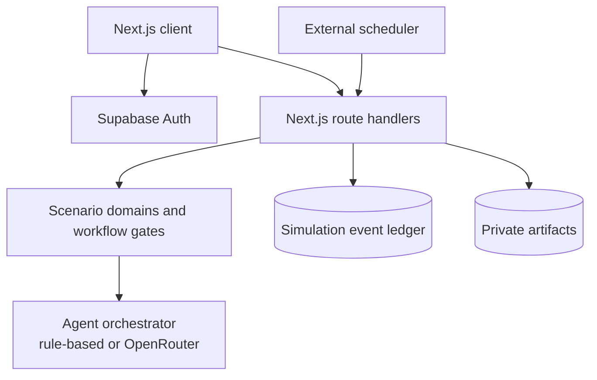

# AIWEX — SignalDesk work simulator

AIWEX is a Next.js learning platform that lets a developer practise a complete
software-team workflow inside a safe SignalDesk scenario. It combines
onboarding, a realistic issue, a code workspace, automated scenario checks,
pull-request review, meetings, a work calendar, and evidence-based coaching.

It is designed for someone who may know how to code but has not yet worked in
an engineering organisation. The product teaches the process around the code:
make work visible, ask clear questions, validate a change, invite review, and
record the decision.

> **Project status:** working learning-simulator alpha. The application can run
> locally and supports authenticated, durable Supabase-backed runs when fully
> configured. Read [Production readiness](#production-readiness) before
> treating it as a multi-user production deployment.

## What is in this repository?

| Name | Meaning |
| --- | --- |
| **AIWEX** | The learning platform and application UI. |
| **SignalDesk** | The first product scenario that a learner works through. |
| **PROJ-184** | The scenario task: create a usage-alerts empty state while respecting billing permissions and a legacy API edge case. |
| **Simulation event ledger** | The append-only record of learner and agent actions used to derive workflow state and private coaching. |

## Features

- Guided onboarding: policies, access requests, knowledge checks, readiness,
  and manager sign-off.
- A learner-controlled simulated workday with calendar events, check-ins, and
  deadlines.
- Issue tracking, team spaces, @mentions, follow-ups, and a meeting room with
  a saved transcript.
- An editable scenario workspace with deterministic checks, commits, PR review,
  approval, merge rationale, and task completion gates.
- An opt-in Eclipse Theia workbench beta, isolated from the platform and kept
  disabled until its deployment controls are configured.
- Optional AI teammates through OpenRouter, with a deterministic local fallback
  so the primary workflow works without a model key.
- Supabase Auth, private simulation runs, RLS, event persistence, and private
  artifact storage when configured.
- Private feedback derived from recorded actions rather than hidden personality
  scoring.

## Product flow



The in-app **Getting started** page is available before onboarding and explains
each step in plain language. The longer reference version is available at
[docs/learner-workflow-guide.md](docs/learner-workflow-guide.md).

## Quick start

### Prerequisites

- Node.js 22 or later (the Docker image uses Node 22).
- npm, supplied with Node.js.
- A Supabase project if you need authentication or durable data.
- An OpenRouter key only if you want live LLM-generated teammate text.

### Install and run

```bash
npm ci
Copy-Item .env.example .env.local
npm run dev
```

Open [http://localhost:3000](http://localhost:3000) for the landing page.
The protected application is served at [http://localhost:3000/app](http://localhost:3000/app).

The landing page can run with an empty `.env.local`. To enter the protected
workspace, configure Supabase Auth as described below. Never commit
`.env.local` or any real secret.

### Required configuration for the protected app

Create a Supabase project, configure an OAuth provider in Supabase Auth, and
add the browser-safe values to `.env.local`:

```env
NEXT_PUBLIC_SUPABASE_URL=https://your-project.supabase.co
NEXT_PUBLIC_SUPABASE_ANON_KEY=your-publishable-or-anon-key
```

Set the callback URL in the Supabase Auth dashboard to:

```text
http://localhost:3000/auth/callback
```

For a deployed application, replace `localhost:3000` with the final HTTPS
domain. The protected `/app` route redirects unauthenticated users to sign-in.

### Enable durable scenario data

Run the Supabase migrations in filename order, then add server-only values:

```env
SUPABASE_URL=https://your-project.supabase.co
SUPABASE_SERVICE_ROLE_KEY=your-server-only-service-role-key
```

The service-role key must never be prefixed with `NEXT_PUBLIC_`, included in
browser code, or committed to the repository.

Without server-side Supabase variables, the simulator uses an in-memory event
store. That is suitable only for local exploration: events disappear when the
server restarts and are not safe across multiple app instances.

## Environment variables

Copy `.env.example` to `.env.local`. The example file contains comments and is
the source of truth for available configuration.

| Variable | Required when | Purpose | Safe in browser? |
| --- | --- | --- | --- |
| `NEXT_PUBLIC_SUPABASE_URL` | Signing in to `/app` | Supabase Auth project URL | Yes |
| `NEXT_PUBLIC_SUPABASE_ANON_KEY` | Signing in to `/app` | Supabase publishable/anon key | Yes |
| `SUPABASE_URL` | Durable simulation data | Server-side Supabase URL | No |
| `SUPABASE_SERVICE_ROLE_KEY` | Durable data and artifacts | Server-only database/storage access | **No** |
| `OPENROUTER_API_KEY` | Live AI teammate responses | Server-side OpenRouter credential | **No** |
| `OPENROUTER_MODELS` | Choosing model/fallbacks | Comma-separated OpenRouter model IDs | No |
| `APP_URL` | Production | Canonical deployed app URL | No |
| `SIMULATION_CRON_SECRET` | Production scheduled work | Authenticates the internal simulation tick | **No** |
| `SENTRY_DSN` | Optional production monitoring | Error-monitoring configuration | No |
| `SCENARIO_STAGING_URL` | Controlled performance scenario | Separate disposable learner target | No |
| `THEIA_ENABLED` | Opt-in workbench beta | Enables isolated Theia session minting | No |
| `THEIA_WORKBENCH_URL_TEMPLATE` | Theia beta | Per-run workbench route; production includes `{runId}` | No |
| `THEIA_SESSION_SECRET` | Theia beta | 32+ character server-only signing secret | **No** |
| `DEMO_MODE` | Public preview | Enables the isolated `/demo` route in production | No |

See [docs/openrouter.md](docs/openrouter.md) for the model-provider behaviour
and [docs/supabase-backend.md](docs/supabase-backend.md) for data setup.

## Local development workflow

Use the same basic discipline that the simulator teaches:

1. Create a focused change.
2. Run the checks below.
3. Review the diff for unrelated edits or secrets.
4. Open a PR with the intent, validation evidence, and any risk.

### Commands

| Command | Use |
| --- | --- |
| `npm run dev` | Run the Next.js development server. |
| `npx tsc --noEmit` | Type-check the project. |
| `npm run build` | Produce and validate an optimized production build. |
| `npm run start` | Serve a build produced by `npm run build`. |
| `docker build -t shiftline .` | Build the standalone production container. |
| `docker run --rm -p 3000:3000 --env-file .env.local shiftline` | Run the container locally. |

Before opening a PR, run:

```bash
npx tsc --noEmit
npm run build
git diff --check
```

There is currently no repository-level automated browser-test command. Until
one is added, manually exercise the happy path described in the learner guide:
onboarding → stand-up → workspace checks → commit → PR → review reply → merge
→ feedback. Do not describe a change as fully verified until this workflow and
the relevant server behaviour have been checked.

## Architecture



### Important design rules

- The browser never gets the Supabase service-role key or an OpenRouter key.
- Route handlers, not the browser, create and append protected simulation data.
- Simulation events are immutable evidence. Workflow state and feedback are
  derived from that record.
- AI providers propose constrained agent actions. Server-side code validates
  permissions and preconditions before an event is recorded.
- Each authenticated learner has a private run derived from their Auth user ID;
  a client cannot choose another learner’s run ID.

For a deeper description of the agent boundary and role permissions, read
[docs/agent-architecture.md](docs/agent-architecture.md).

## Repository layout

```text
src/
  app/                         Next.js pages and API route handlers
  features/
    auth/                      Protected workspace and sign-in UI
    landing/                   Public landing page
    simulator/
      components/              Learner-facing React views
      domain/                  Workflow, onboarding, issues, scoring, scenario rules
      server/                  Event store, agents, Supabase server client
  lib/                          Browser-safe shared integrations

supabase/migrations/           Database schema and RLS policies
docs/                          Operations, backend, agent, and learner documentation
scenarios/                     Scenario assets and controlled validation material
```

## Core workflow gates

The SignalDesk scenario intentionally makes the order of work visible:

```text
stand-up posted
  → scenario checks passed
  → commit created
  → pull request opened
  → review addressed
  → review response sent
  → approval granted
  → merge rationale recorded
  → pull request merged
  → task completed
```

These are not arbitrary UI locks. Each step represents a normal team practice:
communicating a plan, demonstrating evidence, asking a teammate to inspect the
change, documenting the decision, and only then saying the task is complete.

## Data, authentication, and security

### Supabase schema

Apply every SQL file in `supabase/migrations/` in filename order:

1. `202607170001_simulator_backend.sql`
2. `202607180002_private_simulation_runs.sql`

The second migration defines `public.simulation_runs`, links a run to an
`auth.users` record, enables row-level security, and permits learners to read
and update only their own run. Event writes remain server-side; do not add an
anonymous event-write policy merely to make a UI action work.

### Security checklist

- Keep production and learner scenario environments separate.
- Use real Supabase Auth and durable Supabase storage for any shared or
  multi-instance deployment.
- Keep RLS enabled and test positive and negative access cases for each policy.
- Keep `SIMULATION_CRON_SECRET` server-only and send it only from a scheduler.
- Apply rate limits at the edge before opening the app to untrusted users.
- Store artifacts in the private bucket and deliver them through short-lived
  signed URLs.
- Do not load-test the platform production URL; use a disposable,
  spending-limited scenario target instead.

## Production readiness

This repository contains several production-oriented foundations—server-only
secrets, security headers, durable event storage, private runs, RLS, a health
endpoint, a standalone Docker build, and a scheduled-tick interface. A true
multi-user launch still requires operational work:

- Run migrations and verify RLS in a non-production Supabase project first.
- Configure OAuth providers, allowed redirect URLs, and account-recovery
  behaviour.
- Configure monitoring, alerting, backups, retention, and a security review.
- Schedule `POST /api/internal/simulation/tick` every minute with
  `Authorization: Bearer <SIMULATION_CRON_SECRET>` so delayed scenario events
  occur even when a learner closes the browser.
- Add edge rate limiting and explicit organisation-membership records/policies
  before shared human teams are introduced.
- Add automated browser and API regression tests to the CI gate.
- Validate the app against a real Supabase environment, not only the local
  in-memory fallback.

The detailed runbook is at
[docs/production-deployment.md](docs/production-deployment.md). The health
probe endpoint is `GET /api/health`.

## Documentation index

| Document | Audience | Use it for |
| --- | --- | --- |
| [Learner workflow guide](docs/learner-workflow-guide.md) | New learners | Plain-English guide to onboarding, stand-ups, PRs, reviews, meetings, and feedback. |
| [Supabase backend](docs/supabase-backend.md) | Developers | Durable events, authentication boundary, RLS, and artifact storage. |
| [Agent architecture](docs/agent-architecture.md) | Developers | Role model, event-based orchestration, and provider constraints. |
| [OpenRouter provider](docs/openrouter.md) | Developers / operators | Optional live teammate provider and fallback behaviour. |
| [Production deployment](docs/production-deployment.md) | Operators | Deployment, scheduler, health checks, and launch safeguards. |
| [Theia workbench beta](docs/theia-integration.md) | Developers / operators | Isolated deployment, session bridge, security checklist, and rollback. |

## Contribution and pull-request expectations

Keep changes small and explainable. A PR description should answer:

```text
What changed?
Why is it needed?
How was it verified?
What risk, limitation, or follow-up remains?
```

Do not commit secrets, `.env.local`, build output, or unrelated formatting
changes. If a change affects an event type, workflow gate, RLS policy, or API
contract, update the relevant documentation and add or adjust a verification
step in the PR.

## Getting help

- Learner using the app: open **Getting started** from the sidebar, then use
  the next-action card on Home.
- Developer learning the codebase: start with this README, then the
  architecture and backend documents above.
- Deployment question: use the production runbook; do not guess with
  credentials, RLS, or scheduler settings.

The habit this project teaches is also the best way to contribute to it:
understand the goal, make your work visible, validate it, invite review, and
leave a clear record for the next person.
