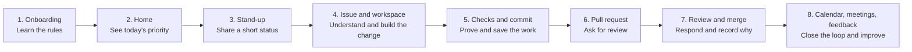

# Your First Simulated Workday

## A no-jargon guide to working in AIWEX

Welcome. This guide is for someone who can write code but has not yet worked in
a software team. You are not expected to know workplace vocabulary already.
The simulation is a safe place to practise it one small action at a time.

The main idea is simple: professional software work is not only writing code.
It is also making the goal clear, keeping people informed, checking the change,
asking for review, and leaving a short record of the decision. The app turns
those habits into a guided project.

> **This is practice, not a personality test.** A blocker, a missed item, or a
> request for clarification is useful information. Say it early, make a plan,
> and continue.

## The whole journey at a glance



You will not normally do every step in one uninterrupted sitting. Real teams
move between focused work, short communication, review, and scheduled events.
The simulation gives you the same rhythm without needing to guess what comes
next.

## A map of the app

The labels may look like a lot at first. Treat them as rooms in one office,
not separate tests.

```text
Home
 ├─ Today’s priority and suggested next action
 ├─ Simulated time controls
 └─ Shortcuts into the work

Onboarding
 └─ Learn rules and get access before project work begins

Issues
 └─ The work request: goal, acceptance criteria, owner, priority, blockers

Workspace
 └─ A safe project area: edit, save, run checks, commit, open a PR

Pull requests
 └─ Review discussion, approval, merge rationale, merge button

Team space
 └─ Messages, questions, decisions, @mentions, follow-ups

Calendar / Meetings
 └─ Scheduled check-ins, focus blocks, deadlines, room transcripts

Feedback
 └─ Private coaching based on actions you recorded in the simulation
```

If you feel lost, return to **Home**. Read the next-action card, then open the
place it points to. You do not need to memorise the whole map.

## Before the project: onboarding

Onboarding is the equivalent of a new starter learning how a company works
before being given production access. In AIWEX, it is deliberately ordered:

1. Confirm your profile.
2. Read and acknowledge the three operating policies:
   security baseline, data protection, and the engineering operating model.
3. Request the listed system access items.
4. Complete the short knowledge slides and their questions.
5. Complete the readiness check.
6. Request manager sign-off.

The readiness check requires a passing score. That is not meant to catch you
out; it confirms you saw the safety and process rules before the project opens.
If an answer is wrong, read the feedback, revisit the relevant idea, and try
again.

### Why these steps exist in a real company

| Simulation step | Plain-English reason |
| --- | --- |
| Policy acknowledgement | You know how to handle company and customer information safely. |
| Access request | People should only receive the systems and permissions they genuinely need. |
| Knowledge check | The team confirms the basic rules were understood, not merely clicked through. |
| Manager sign-off | Someone accountable confirms you are ready for the next stage. |

Once qualified, the project areas, work calendar, and meetings become active.

## The core words, translated

You will see these words repeatedly. None of them are mysterious.

| Word | What it means | A simple way to think about it |
| --- | --- | --- |
| **Issue / ticket** | A written work request. | A small, trackable chapter of a project. |
| **Acceptance criteria** | The conditions that must be true for the work to count as complete. | The definition of “done.” |
| **Stand-up** | A short team status update, often daily. | A 30-second way to prevent surprises. |
| **Blocker** | Something stopping you from moving forward. | A reason to ask for help early, not a failure. |
| **Dependency** | Something another person, system, or decision must provide first. | A hand-off you are waiting for. |
| **Workspace** | The safe area where you work on the scenario. | Your practice desk and project files. |
| **Check / test** | An automatic or repeatable verification that the change behaves as expected. | Evidence, not just a feeling, that it works. |
| **Commit** | A named saved checkpoint of a change. | A bookmark another engineer can inspect. |
| **Branch** | An isolated line of work before it reaches the main project. | A side copy for your change. |
| **PR / pull request** | A request asking teammates to review a proposed change. | “Here is my work; please inspect it before it becomes shared.” |
| **Code review** | A teammate reads a change and asks questions or suggests improvements. | A quality conversation, not an attack. |
| **Approval** | A reviewer says the PR meets the agreed standard. | Permission to include the change in the shared project. |
| **Merge** | Adding an approved branch into the shared main version. | Making the change part of the project. |
| **Merge rationale** | A brief written note explaining why it is safe to merge. | A future-friendly decision record. |
| **Risk** | Something that may affect delivery, quality, or users if it happens. | A heads-up with an impact and a plan. |
| **Escalation** | Asking the right person to help resolve a risk or decision. | Raising a flag early enough for the team to act. |
| **Retro / feedback** | Looking at evidence after work to decide what to improve next time. | Learn one useful lesson, then apply it. |

## Your first project, from start to finish

The practice task is **PROJ-184: Build usage alerts empty state**. Treat it as
an example of a small but realistic product change. The product needs a helpful
empty screen when there are no alerts, while keeping the billing action hidden
from people who are not allowed to manage billing.

The exact code is yours to work through. This guide focuses on the professional
workflow around it.

### 1. Read the issue before opening the editor

Open **Issues** and choose PROJ-184. Read these parts slowly:

- The title tells you the intended outcome.
- The description gives context.
- The acceptance criteria list the observable behaviours that must be true.
- The owner, priority, and status tell the team who is handling it and how
  urgent it is.
- Any dependency or blocker tells you what could affect the work.

For this scenario, translate the acceptance criteria into your own words:

```text
When there are no alerts:
  - show a useful title and action;
  - do not show the billing CTA to a restricted role;
  - keep the empty state working when an older workspace has no threshold.
```

This translation is valuable. It tells you what to test after the change.
Do not start by trying to make the code look clever. Start by making the
behaviour understandable.

### 2. Post a stand-up update

In many teams, a stand-up is a short update in the morning. It is not a long
report and it is not a place to prove you were busy. Its purpose is to make
today’s plan and risks visible before they become surprises.

Use this three-line structure:

```text
Yesterday: I completed onboarding and reviewed PROJ-184.
Today: I will implement and validate the usage-alerts empty state.
Blocker: None right now; I will ask if the legacy threshold behaviour is unclear.
```

If you do have a problem, name it plainly:

```text
Blocker: I need confirmation of the expected empty-state action for users
without billing permissions. I have asked Noah in the project channel.
```

That is good professional communication. You do not need to solve the blocker
before mentioning it.

### 3. Ask a precise question when something is unclear

Use **Team space** when the issue or review note leaves a real uncertainty.
Mention the person who can answer it with `@Name`. Include enough context that
they can help without reconstructing your entire situation.

Good example:

```text
@Noah For PROJ-184, I plan to hide “Review your plan” when
canManageBilling is false. Should the empty-state title still appear for a
legacy workspace that has no threshold field?
```

Less useful example:

```text
@Noah I am confused. What should I do?
```

The first question says what you observed, what you plan, and exactly what you
need decided. This is the pattern to copy.

### 4. Work in the workspace

Open **Workspace** from the issue or Home. It contains the scenario project,
the editable files, and the technical context needed for the task.

Use this order:

1. Read the task brief and the tech lead’s note.
2. Locate the relevant file in the Explorer.
3. Make the smallest change that satisfies the acceptance criteria.
4. Save the revision.
5. Run the scenario checks.

The Explorer’s folders can be expanded and collapsed with their arrows. Open
only the folders you need; this keeps your attention on the current task rather
than the whole project tree.

The workspace is not testing whether you can type a large amount of code. It
is testing a habit: understand the requirement, make a contained change, and
validate it.

### 5. Run checks, then commit

Click **Run scenario checks** after saving your work. A check is a repeatable
way to verify the acceptance criteria. In a company this might run unit tests,
type checks, security scans, or browser tests. Here it validates the scenario
requirements.

If checks fail:

1. Read the message rather than immediately changing random code.
2. Match the failure to an acceptance criterion.
3. Correct the smallest relevant part.
4. Save and run the checks again.

Passing checks does not mean “my code can never have a problem.” It means you
have evidence that the agreed checks pass at this moment.

When they pass, click **Commit changes**. A commit is a clear checkpoint that
says, “this is the version I am proposing for review.” In a real project, a
useful commit message describes the outcome, for example:

```text
Guard usage-alerts billing CTA by role
```

You do not need a perfect literary sentence. Make it specific enough that a
teammate can recognise the change later.

### 6. Open a pull request (PR)

After a passing commit, select **Open pull request**. This creates a proposal
for the shared project. A PR is normal work, not an emergency and not a sign
that you need to be certain of every detail.

Before asking for review, a good PR gives a reviewer three things:

```text
What changed: Added the no-alerts empty state and guarded the billing action.

Why: Restricted users must not see a billing-management CTA.

How I checked it: Ran the scenario checks, including the legacy no-threshold case.
```

In a real company, you would often put this in the PR description. The
simulation provides the review workflow directly so you can practise the same
discipline.

### 7. Receive review without panic

Open **Pull requests**. A reviewer may request a change. That does not mean
you failed. It means the review found something worth clarifying before it
becomes part of the shared codebase.

For this task, the review reinforces two important points:

- Use the role guard before showing the billing-plan CTA.
- Explain the validation in your response.

Work through the review in this order:

1. Read the full review note.
2. Make or verify the requested change in the workspace.
3. Mark the review item as addressed only after you understand it.
4. Write a short, factual response.
5. Wait for the required approval, then record the merge rationale.

A strong review response names the decision and evidence:

```text
I added the canManageBilling guard so restricted users do not receive the
billing CTA. I also kept the empty state independent of the legacy threshold
field and reran the scenario checks successfully.
```

Avoid replies such as “fixed” or “done.” They make the reviewer ask a second
question: *what was fixed and how did you verify it?*

### 8. Record the merge rationale and merge

After the response and approval are complete, write a merge rationale. This is
not bureaucracy for its own sake. Future teammates may need to know why a
decision was safe at the time.

Example:

```text
The empty state now gives users a clear next step, while the billing CTA is
shown only to authorised users. Scenario checks cover the restricted-role and
legacy no-threshold cases, so this is safe to merge.
```

Then select **Merge pull request**. In real terms, the change is now accepted
into the shared main branch. In the simulation, that unlocks task completion
and gives the feedback system evidence of the whole workflow.

### 9. Complete the task

Mark the task complete only after the PR is merged. This order matters:

```text
Work changed → checks passed → committed → reviewed → approved → merged → complete
```

If a real team marks a task complete before review or merge, the board no
longer represents reality. The simulation uses these gates so you can build a
trustworthy habit.

## Meetings, calendar events, and time

### Simulated time is deliberately learner-controlled

The clock on **Home** starts at a scenario time and does **not** continue by
itself while you are away. You decide when to advance it:

- **Next event** moves directly to the next planned scenario trigger.
- **+15m** is a short focus block.
- **+1h** moves a larger part of the day.
- **More** offers additional options.

The next planned event is shown before you move time. This lets you finish a
thought, read the task, or prepare a message without being punished for taking
time to learn. It is a hybrid of real work and training: events feel like a
workday, but you control the pace.

Use the clock when you are ready to practise the next event, not as a timer you
must race.

### Calendar

The **Calendar** shows focus blocks, ceremonies, review windows, and deadlines.
Open an item to see its status and available action. Some calendar items can be
completed while their window is active. A deadline may offer a recovery action
if it has been missed; follow the on-screen prompt and communicate the recovery
plan in the relevant team channel.

In real work, a deadline needs a message before it is missed whenever possible:

```text
Risk: PROJ-184 review may extend past today’s review window because the role
guard needs validation. Impact: merge could move to the next release window.
Plan: I will finish validation by 15:00 and request review immediately after.
```

That message helps a manager or teammate make a decision. It is much better
than silently hoping the deadline will disappear.

### Meetings

For a ceremony in the calendar, select **Open room**. You can start the room,
send messages, react, and end it. The saved transcript is the simulation’s
record of the conversation.

Use a meeting for decisions, alignment, and updates that benefit from everyone
hearing the same thing. Keep the message concise and action-oriented:

```text
Update: PROJ-184 checks are passing. The PR is open and the remaining step is
the review response and approval. No delivery risk at the moment.
```

After a real meeting, it is good practice to write down the decision and owner
in the team space or issue. That way someone who was not in the room can still
find the context.

## Team communication: five useful templates

You do not need corporate-sounding language. Clear, small messages are better.

### Stand-up

```text
Yesterday: …
Today: …
Blocker: none / …
```

### Clarifying question

```text
@Name Context: …
I plan to: …
Question: …
```

### Risk or escalation

```text
@Name Risk: …
Impact: …
What I have tried: …
Decision or help needed by: …
```

### Review response

```text
I changed: …
Reason: …
Validation: …
```

### Meeting follow-up

```text
Decision: …
Owner: …
Next step and time: …
```

The useful pattern in every case is the same: **context, action, evidence, and
the next thing needed**.

## What “good” looks like

There is no need to perform confidence. A reliable junior engineer is someone
who makes their work understandable and asks early when the decision is not
clear.

| Situation | Productive response |
| --- | --- |
| You do not understand a requirement. | Restate your interpretation and ask one specific question. |
| A check fails. | Read it, connect it to the requirement, make a focused correction, rerun it. |
| A reviewer asks for changes. | Address the point, explain what changed, say how you validated it. |
| You may miss a deadline. | Raise the risk with impact and a recovery plan before the deadline if possible. |
| You made a mistake. | State what happened, what it affects, what you are doing next, and who needs to know. |
| You finish a change. | Make sure the PR, approval, merge, and task status all match reality. |

## Feedback and progress

The **Feedback** page is private coaching. It derives its signals from recorded
simulation actions: workflow events, communication, review responses, mentions,
and event timing. It is not a hidden judgement about your personality.

Use it after meaningful work, especially after a merged task. Read it this way:

1. Find one piece of evidence it cites.
2. Identify one behaviour you want to repeat or improve.
3. Use that behaviour in the next task.

Example:

```text
Evidence: I posted a stand-up before beginning the task and included a
dependency question in the right channel.

Learning: I made the work visible early.

Next time: I will use the same structure when I spot a deadline risk.
```

The early levels are intentionally small. Completing basic scenario work with
the expected technical and process evidence unlocks later work. The goal is
steady practice, not speed-running the interface.

## A calm checklist for every task

Copy this into a note if it helps.

```text
[ ] I understand the issue and its acceptance criteria.
[ ] I shared a short status update or raised a real blocker.
[ ] I asked a precise question if a decision was unclear.
[ ] I made the smallest change that meets the requirement.
[ ] I saved it and ran the relevant checks.
[ ] I committed the passing work.
[ ] I opened a PR and read the review carefully.
[ ] I explained what changed and how I validated it.
[ ] I recorded a meaningful merge rationale.
[ ] I merged before marking the task complete.
[ ] I reviewed feedback for one lesson to use next time.
```

## When you are stuck

Try this order before guessing:

1. Read the next-action guidance on **Home**.
2. Re-read the issue’s acceptance criteria.
3. Read the technical context in the **Workspace**.
4. Look for the next required gate in **Pull requests**.
5. Check the **Calendar** for the active event or available recovery action.
6. Ask a focused question in **Team space** and mention the person who can
   decide.

Being stuck for a few minutes is normal. Staying silent for a long time is what
makes teamwork difficult, because nobody knows you need help.

## Frequently asked questions

### Do I need to know all these words before I start?

No. Use the glossary when a word appears. After one full project loop, terms
such as stand-up, PR, review, and merge will feel much more ordinary.

### Is a PR the same as submitting a job application?

No. A pull request is an internal request to review a code change. It is a
normal part of engineering work and you may open many of them each week.

### Is a review request a sign my work is bad?

No. Review exists because shared code benefits from a second set of eyes. Even
experienced engineers receive review comments.

### What if I do not know the perfect answer?

State your current interpretation, cite the relevant requirement, and ask the
smallest question needed to continue. That is usually stronger than waiting for
certainty.

### Why not let simulated time move automatically?

The simulation is a learning environment. Keeping time learner-controlled
allows you to read, experiment, and prepare without events passing while you
are away. Use **Next event** whenever you want the workday to continue.

### What is the difference between an issue and a PR?

An issue describes *the problem or desired outcome*. A PR presents *your
proposed solution* for that issue. Think “request” first, then “solution for
review.”

### What should I do after a missed deadline?

Use the calendar’s available recovery action, communicate the impact and your
recovery plan in the relevant channel, then take the next concrete step. Do not
hide the problem or write a long apology instead of a plan.

## One final mental model

You are not expected to become a complete professional engineer by memorising
process terms. Build one loop repeatedly:

```text
Understand → communicate → build → verify → invite review → record the decision → learn
```

Each loop makes the next one less overwhelming. Start with the next action on
Home, and let the simulation show you the rest.
